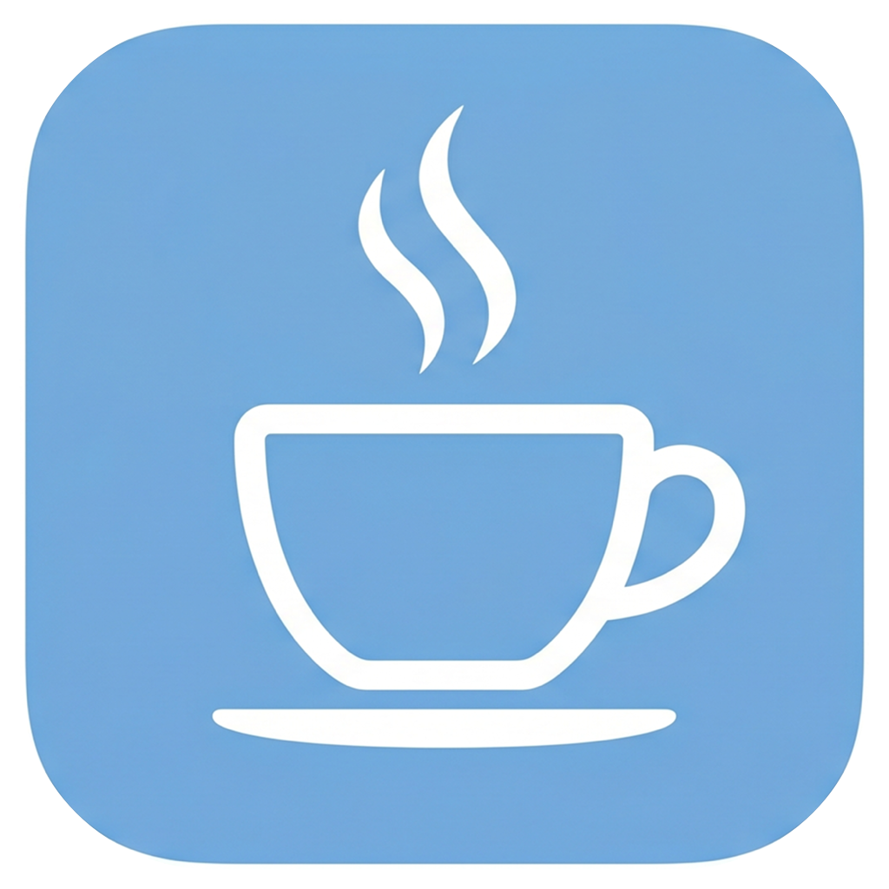

  

<h1 align="center">KeepMirror</h1>

  <strong>Your Mac, wide awake — for exactly as long as you need.</strong>

  <a href="https://github.com/adhamhaithameid/KeepMirror/releases">⬇ Download</a> ·
  <a href="docs/install-from-github.md">Install Guide</a> ·
  <a href="docs/faq.md">FAQ</a> ·
  <a href="docs/privacy.md">Privacy</a>

---

## What is KeepMirror?

KeepMirror is a tiny macOS app that lives in your menu bar. One click keeps your Mac awake for as long as you choose — no fiddling with System Settings, no idle caffeine scripts, no full app windows cluttering your screen.

It's for the moments that matter:

- Your **presentation** is running and you can't have the screen go dark mid-slide.
- A **large file upload or download** is running and you need the Mac to stay on.
- You're **screen sharing** and macOS keeps dimming your display at the worst time.
- You stepped away and need Time Machine or a sync job to **finish uninterrupted**.

When your session ends, KeepMirror gets out of the way. Your Mac goes back to its normal sleep schedule automatically.

---

## How to use it

### Starting a session

| Action | What happens |
|---|---|
| **Left click** the ☕ icon | Starts your default duration instantly |
| **⌥ Option + click** the icon | Same as left click — fastest way to start |
| **Right click** the icon | Opens the menu with duration buttons and all options |
| **Click a duration button** (15m, 1h, ∞ …) | Starts a session for that exact duration |

### Stopping a session

- Click the red **Stop Session** button inside the menu, or
- Left click the icon again (when a session is already running), or
- Wait — KeepMirror stops automatically when the time is up.

### Reading the status at a glance

The menu bar icon tells you everything:

| Icon | Meaning |
|---|---|
| ☕ (outline) | Inactive — your Mac sleeps normally |
| ☕ (filled) | Active — your Mac is being kept awake |
| ☕ **42m** | Active, 42 minutes left in this session |

Open the menu and you'll see a live countdown with a depleting progress ring, the remaining time down to the second, and your current battery level if a threshold is set.

---

## Key features

### ⏱ Flexible session lengths
Choose from built-in options: `15m`, `30m`, `1h`, `2h`, `3h`, `5h`, `8h`, `12h`, `1 day`, or `Indefinitely`. Add your own custom durations in Settings anytime.

### 🔋 Battery-aware
Set a battery percentage threshold and KeepMirror will stop automatically when your battery drops below it. Optionally, it also stops the moment **Low Power Mode** turns on.

### 🌙 Automation — hands-free activation
- **Focus Mode** — KeepMirror can activate automatically whenever you turn on Focus or Do Not Disturb, so presentations and deep-work sessions always stay awake.
- **Screen Sharing** — detects when you start screen sharing (or AirPlay mirroring) and activates immediately. No clicks needed.

### 💤 Allow Power Nap
Running a long backup or iCloud sync? Enable **Allow Power Nap** and KeepMirror keeps your Mac awake without blocking background tasks like Time Machine, push email, and iCloud Drive.

### 🖥 Optional display control
By default, KeepMirror keeps the system awake but lets the display sleep normally. Turn off **Allow Display Sleep** if you need the screen to stay on too.

### 🔔 Notifications
KeepMirror taps you on the shoulder 5 minutes before a session ends, with an **Extend +30m** button right in the notification. Auto-stop events (Low Power Mode, battery threshold) also send a notification explaining why the session ended.

### 🛡 Quit protection
If you accidentally press ⌘Q while a session is running, KeepMirror asks you to confirm before quitting. Your presentation won't drop mid-slide.

---

## Getting started

1. Download the latest [release](https://github.com/adhamhaithameid/KeepMirror/releases).
2. Drag `KeepMirror.app` into your **Applications** folder.
3. Open it — the ☕ icon appears in your menu bar.
4. Left-click to start your first session.

> [!TIP]
> macOS may warn about an unidentified developer on first launch. Right-click `KeepMirror.app`, choose **Open**, then confirm **Open** in the dialog that appears. You only need to do this once.

> [!TIP]
> To have KeepMirror start every time you log in, open Settings (right-click the icon → Settings…) and turn on **Start at Login**.

---

## Privacy

KeepMirror has no internet connection, no analytics, no tracking, and no accounts.

It does **not** require:
- Accessibility access
- Input Monitoring
- Screen Recording

The only permission it may ask for is **notifications** (optional), so it can alert you when a session is ending.

The only OS prompt you'll see otherwise is the standard login-item approval if you enable **Start at Login**.

---

## Documentation

| Guide | What's inside |
|---|---|
| [Install Guide](docs/install-from-github.md) | Download, install, and first launch |
| [FAQ](docs/faq.md) | Common questions answered |
| [Safety](docs/safety.md) | How auto-stop protects your battery |
| [Troubleshooting](docs/troubleshooting.md) | Fixes for common issues |
| [Privacy](docs/privacy.md) | Full data and permissions statement |
| [Manual Testing](docs/manual-testing.md) | Verify the app is working correctly |
| [Uninstall](docs/uninstall.md) | Fully remove KeepMirror |

---

## Support the project

If KeepMirror saves you time, consider buying me a coffee ☕

---

## License

Source-available under the [PolyForm Noncommercial 1.0.0](LICENSE.md) license.
